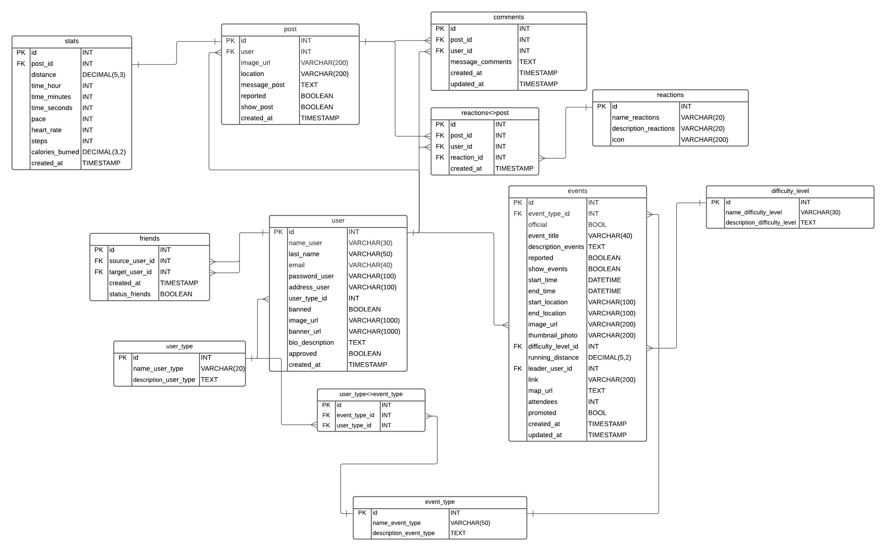

# RUNasville-backend

## Setup and run backend

Do the following commands in order to successfully launch the test server backend for RUNashville:
- npm install
- mysql -u [mysql_username] -p < db/schema.sql
- npm start

## Database Schema

The database schema is the following

## API Endpoints

Use /api/[endpoint]

### Services 
| Endpoint | Method | Description |
| ------ | ------ | ------ |
| /login | POST | Send login credentials to authenticate |
| /signup | POST | Send signup information to the platform |

### User

| Endpoint | Method | Description |
| ------ | ------- | ------ |
| /user/:id/type | GET | Get the user Type by id |
| /user/:id | GET | Get the user details by id |
| /friends/:uid | GET | Get the friends of the user by id |
| /users/banned | GET | Get all the banned users |
| /users | GET | Get all the users |
| /user | PUT | Update the user information |

The format for updating the user information (PUT METHOD) is the following

{
      update: 'field',
      value: [the new value],
      userId: id,
}

Where the update property of the object is the field in the database you want to update:

| Field Name | Description |
| ------ | ------ |
| banned | Update banned status |
| name | Update name |
| last_name | Update last name |
| address | Update the address of the user |
| profile_picture | Update Profile Picture |
| profile_banner | Update Profile Banner |

The Id is the user Id to update 
The value is the value to be inserted in the database 

Example:

{
      update: 'banned',
      value: true,
      userId: 12,
}

### Post

| Endpoint | Method | Description |
| ------ | ------ | ------ |
| /post/all | GET | Get all the post in the platform |
| /post | GET | Get all the post of a certain user using id as a query parameter, example url.com?id=THE-ID |
| /post/:id/reported | GET | Get all the post of the user that are reported |
| /:postId/stats | GET | Get all the stats for a certain post |
| /:postId/comments | GET | Get all the comments for a certain post |
| /post/reported | GET | Get all the reported posts in the platform |
| /post/report/:id | PUT | Report a post |
| /post | POST | Create a new post |
| /post/comment | POST | Add a comment to a post |
| /post/likes | POST | Like a post |

### Events
| Endpoint | Method | Description |
| ------ | ------ | ------ |
| /events | GET| Get all the events |
| /events/promoted | GET | Get all the promoted events |
| /events/hidden | GET | Get all the events where show_event is false |
| /events/reported | GET | Get all the reported events |
| /events/:id | GET | Get all the events created by an specific user |
| /events/ | POST | Post a new event in the platform |

### Admin
| Endpoint | Method | Description |
| ------ | ------ | ------ |
| /users/ban | PUT | Update the ban status of many users by passing an object to the body |

{
      userId: [id1,id2,id3],
      value: true 
}

Where the userId is an array of userIds to update with the value true or false ( to ban or unban when needed)
